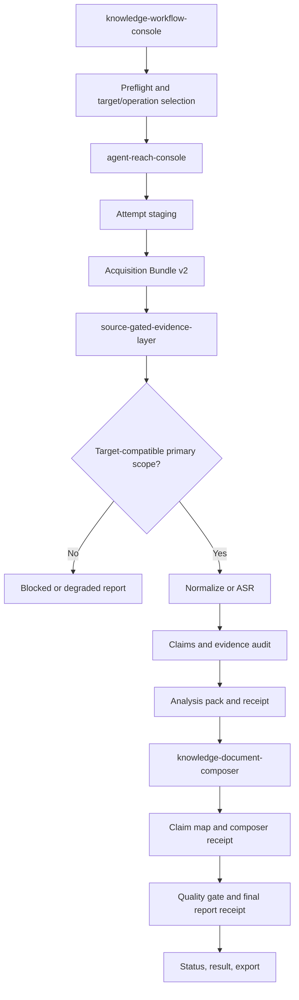

# Architecture

Knowledge Workflow is a run-scoped, source-gated acquisition-to-report system.



## User-Facing Skills

| Layer | Owns | Must not own |
| --- | --- | --- |
| `knowledge-workflow-console` | product routing, preflight, explicit stages, status, result index | platform-specific scraping, evidence promotion, report claims |
| `agent-reach-console` | Agent-Reach install/doctor, backend capability plan, acquisition, Bundle v2 | source gate, claims, evidence audit, final reports |
| `source-gated-evidence-layer` | bundle validation, target/scope gate, normalization, ASR handoff, claims, evidence audit, degraded output | platform login, cookies, raw browser control |
| `knowledge-document-composer` | claim map, Source / Inference / Extension, planning, quality gate, final report | acquisition, source-status repair, metadata promotion |

`knowledge-video-decomposer` is an internal compatibility library. Its
normalizer, ASR, segmenter, inventory, source-logic, evidence-audit, and pack
scripts are reused by the evidence layer. It is not a user-facing route.

## Stable Handoff

The only acquisition-to-evidence interface is:

```text
00_acquisition/manifest.json
```

The evidence layer never reads an arbitrary Agent-Reach stdout file directly.
The composer never reads an acquisition bundle directly.

## Two Independent Gates

### Backend capability gate

Before acquisition, doctor must report `status: ok`, and the adapter must
implement the requested operation for the active backend. A healthy search
backend cannot be used as a transcript backend.

### Evidence target gate

After acquisition, an artifact must be primary and have a scope that satisfies
the requested target. Post text and embedded-video content are intentionally
different scopes.

## Run and Attempt Model

```text
logs/run_identity.json         one immutable source/target/operation
.kw_staging/<attempt_id>/      temporary attempt
00_acquisition/                current validated bundle
acquisition_history/           prior validated bundles
run_history/                   prior downstream output trees
```

The current bundle is never assembled in place. A retry is a new attempt and
requires `--resume`. A changed source, target, or operation requires a new
project root.

## Provenance Chain

```text
manifest SHA-256
  -> gate_receipt.json + source_status SHA-256
  -> analysis_receipt.json + pack SHA-256
  -> composer_receipt.json + claim_map/intake SHA-256
  -> final_report_receipt.json + quality_gate/report SHA-256
```

Status, result, export, quality, templates, and batch synthesis trust this
chain. File existence alone is non-authoritative.

## Compatibility Layout

The evidence stage still writes `10_video/` so existing analyzers continue to
work. Non-video targets also receive `source_analysis_pack.md`; the legacy
`video_analysis_pack.md` may exist as an internal intermediate. A future
release may rename the directory to `10_source/`, but that migration is not
part of Bundle v2.

## Legacy Acquisition

The following scripts remain for compatibility and regression tests, not as
the primary URL route:

- `acquisition_runner.py`;
- `platform_media_runner.py`;
- `chrome_media_probe.py` as a platform acquisition controller;
- generic-web fallback for login-required platforms.

They cannot bypass Bundle v2, the target/scope gate, or provenance receipts.
