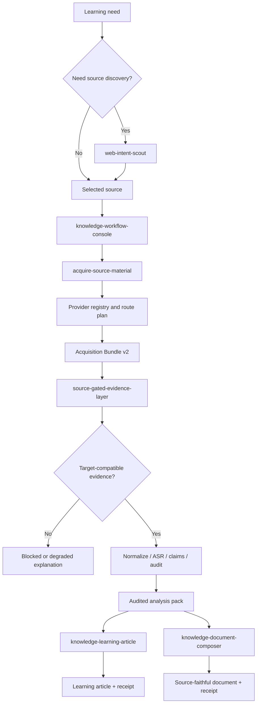

# Architecture

Knowledge Workflow is a run-scoped, source-gated discovery-to-learning system.



## Product surfaces

The product has three conceptual parts:

1. discovery through `web-intent-scout`;
2. controlled knowledge acquisition and evidence processing through `knowledge-workflow-console`;
3. learning-oriented transformation through `knowledge-learning-article`.

Acquisition, evidence, and document composition remain separate worker skills so no layer can silently grant itself report permission.

| Skill | Owns | Must not own |
| --- | --- | --- |
| `knowledge-workflow-console` | routing, preflight, stages, status, result index | provider commands, evidence promotion, report claims |
| `web-intent-scout` | intent map, queries, source ledger, candidate selection | promoting snippets into primary evidence |
| `acquire-source-material` | provider probes, operation plan, staged acquisition, Bundle v2 | SourceStatus, evidence audit, reports |
| `source-gated-evidence-layer` | bundle validation, target/scope gate, normalization, ASR, claims, audit | platform login, cookies, provider installation |
| `knowledge-learning-article` | knowledge map, prerequisites, learning order, learning article | acquisition or repair of missing source claims |
| `knowledge-document-composer` | claim map, Source/Inference/Extension, quality gate, final document | acquisition or source-status repair |

`knowledge-video-decomposer` is an internal compatibility library. `browser-host-identity` is an independent project, not a workflow stage or managed dependency.

## Native acquisition boundary

The project owns capability discovery and route planning. It directly probes optional providers such as `yt-dlp`, `curl`, `gh`, `bili`, OpenCLI and `mcporter`. No intermediary acquisition runtime is imported or executed.

Channels without a structured adapter use the same provider-neutral boundary:

```text
authorized browser / CLI / API / user export
  -> saved task-primary artifact
  -> kw source import
  -> Acquisition Bundle v2
```

The only acquisition-to-evidence handoff is `00_acquisition/manifest.json`. The evidence layer never trusts arbitrary provider stdout, and output skills never read provider output directly.

## Independent gates

Before acquisition, the capability gate requires a ready Provider, operation support, and any declared browser host. After acquisition, the Source Gate requires a primary artifact whose `content_scope` satisfies the requested `analysis_target`.

A command succeeding does not imply source confirmation. A post body cannot satisfy embedded-video analysis; search results cannot satisfy article analysis; raw media must finish ASR before transcript-dependent analysis.

## Run model

```text
logs/run_identity.json         immutable source/target/operation
.kw_staging/<attempt_id>/      temporary acquisition attempt
00_acquisition/                current validated bundle
acquisition_history/           prior validated bundles
run_history/                   prior downstream outputs
```

Retries require `--resume`. A changed source, target or operation requires a new project root.

## Provenance chain

```text
manifest SHA-256
  -> gate_receipt + SourceStatus SHA-256
  -> analysis_receipt + analysis-pack SHA-256
  -> learning/composer receipt
  -> quality gate + final receipt
```

Status, result and export commands trust the chain, not file existence.
